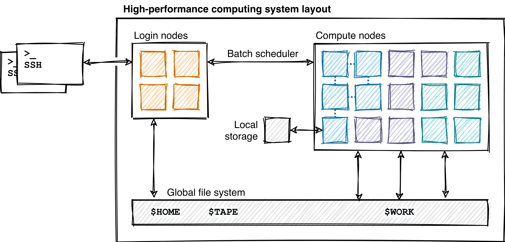
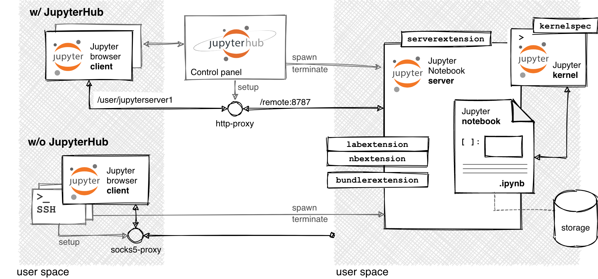

<!--
create PDF with
```shell
docker run --rm --volume "$(pwd):/data" --user "$(id -u):$(id -g)" pandoc/latex:latest white-paper.md --toc --pdf-engine=xelatex --variable fontsize=12pt -o white-paper.pdf
```
-->

<!--
alt title: Jupyter services at the Jülich Supercomputing Center (JSC) from a scientific target-user perspective
maybe choose "... from a scientific end-user perspective"?
-->

¹GEOMAR Helmholtz Center for Ocean Research Kiel, Germany<br>
²Faculty of Mathematics and Natural Sciences, Christian-Albrechts-Universität zu Kiel, Germany

## Abstract

Several high-performance computing (HPC) centers have started to provide Jupyter-based access to their compute infrastructure.
Jupyter tools are designed to simplify and have now become a popular choice for interactive computing tasks.
The Jupyter software itself comes with a wide range of deployment options and due to the in-build extensibility of the user interface it also allows for the set up of highly customized working environments.
While this configurability is a key strength of Jupyter software especially from a user's productivity perspective, it poses a challenge for Jupyter service providers and hence ready-to-use implementations might not turn out to improve individual scientific productivity in an optimal way.
Here, scientific user productivity requirements for JupyterHub deployments at HPC systems are formulated.
These have been developed along with a detailed investigation of the Jupyter-JSC service, which is a very mature and feature-rich implementation provided by the Jülich Supercomputing Center (JSC).
We assess aspects such as documentation, accessibility, system state reporting, fine-tuning of high-performance computing resources, and Jupyter notebook server and Jupyter kernel defaults and customization.
In doing so, suggestions are given that are targeted not only at maximizing the productivity of scientific target users, but also at minimizing system administrator workload.
This paper might serve as a discussion basis for the setup of Jupyter@HPC reference implementations, which would be important in light of the recent developments in the HPC community: The increasing importance of HPC for data analysis and machine-learning workloads, and the upcoming paradigm shift, i.e. Jupyter-based HPC system access as a replacement for the traditional SSH-based access.


## Introduction

SOMEWHERE HERE, ENSURE THAT IT'S CLEAR WE, WE INTEND TO PROVIDE IMPLEMENTABLE SUGGESTIONS FOR A PROBLEM THAT WAS POSED IN [@GOEBBERT-ET-AL-2018]: HOW TO MANAGE DIVERGING DEMANDS OF ALL THE USERS AND THEIR INTERACTIVE COMPUTING SOFTWARE ENVIRONMENTS ON A CENTRALLY MANAGED JUPYTERHUB DEPLOYMENT

In this section, we'll briefly describe what problems high-performance computing (HPC) is tackling, what exactly project Jupyter software aims at and what challenges on HPC it might solve. We'll also briefly introduce the JupyterHub service at the Jülich Supercomputing Center (JSC), which is a ready-to-use JupyterLab web client environment providing access to a variety of their systems and which has seen several years of active developed and has evolved into a mature system.
Finally, we define the scope of this report.

### What is high-performance computing?

High-performance computing (HPC) centres such as the the Jülich Supercomputing Center (JSC) provide research infrastructure which is shared among many scientific disciplines [@wissenschaftsrat-2015].
As, e.g., pointed out by [@wissenschaftsrat-2020], HPC and is no longer only relevant for classical simulations applications but increasingly so for data analysis and machine-learning workloads [@wissenschaftsrat-2020].

Typical HPC hardware allows and is optimized for highly parallel computations.
It allows for high-performance scaling of parallel simulation/application software across a many compute nodes, with the goal of improving overall execution walltimes.
Thereby, HPC systems make the simulation of highly complex systems such as, e.g., the global climate, feasible at all, and often are the only available systems able to handle large-volume scientific data analysis and visualization tasks.

The typical HPC system layout consists of several compute nodes with high-performance multi-core CPUs and/or general-purpose GPUs, high-bandwidth and low-latency network connectivity in between the compute nodes, and one or more storage systems optimized for high capacity and high bandwidth and/or for extremely low latency.
To optimally utilize the specialised hardware, system specific drivers, and optimized code and builds of scientific software are used.
This optimization typically needs assistance by specialists employed at the computing centres providing the HPC systems.
As a general rule the need for optimization and system specific adaptation of components of software is stronger the closer the component is to the utilization of hardware-specific features.
TODO JSC-PEOPLE: GIVE A FEW EXAMPLES FOR ADAPTED LIBRARIES HERE (EG NETWORK/UCX AND GPU/CUDA AND NUMPY/MKL/BLAS/BOOST)?


 <!-- ASK SIMONE KNIEF FOR PERMISSION TO USE THIS IMAGE -->
<!-- REFER TO THE IMAGE IN THE TEXT? -- No, this is fine. We could add a figure caption, thouhg? -->

High-performance computing systems are (almost) exclusively operated by Linux systems [@top500.org/1] and are natively accessible via SSH. The user accesses the system via one of a few dedicated login, frontend or gateway nodes and has to request actual compute resources via a batch job scheduling system.
The batch scheduler allocates available compute resources according to a specified scheduling policy.
Often, compute node resources are heterogeneous (in terms of CPU type, GPU acceleration, or installed memory on a group of compute nodes) and organized into separate batch partitions.
Upon submitting requests to the batch scheduler, users have to manually specify resource needs such as node/partition type, number of compute nodes, CPUs, GPUs, amount of memory, as well as a prospected job duration.

### What is Jupyter?

Jupyter is a stack of open-source software tools for interactive computing, as well as a collaborative  community of users and developers [https://jupyter.org/about].
The mission of project Jupyter is to improve the workflows of scientific computing practitioners (e.g. researchers, educators, or scientists) from the exploratory phase of their work to the communication of results and insights [https://blog.jupyter.org/and-voil%C3%A0-f6a2c08a4a93].
Major software development platforms such as Github and Gitlab provide built-in rendering of Jupyter Notebooks [@Project-Jupyter-2015].
Furthermore, Jupyter Notebooks are, among other literal computing languages, discussed as the basis for executable journal articles (see, e.g., [@Lasser-2020]).
The flagship tool is the Jupyter notebook, which is a computational lab-book that holds code, computational output, and explanatory text, as well as, e.g., multimedia resources in a single document [@Perkel-2018].
Jupyter Notebooks are structured JSON files which are human readable and hence easy to track and compare in common version control systems. 

Jupyter tools originate in the IPython project [@Ipython-project-website].
IPython is a Python prompt that allows for working on a mix of scripts and other elements of computational workflows from a single interface.
It was created by Fernando Peréz, as a solution for his own very complex scientific data analysis workflows, and with the intention of improving daily scientific productivity, especially by removing as many context switching barriers as possible.
IPython was later developed into a unified interface with notebooks and multi-language kernels, file browser, and a basic text editor, which was finally renamed to Jupyter.

Due to its flexible design that aims at maximising extendability, Jupyter enables interactive work on various systems.
As such, it is a promising tool to make usable resources at scales only available with HPC systems to data scientists who are not familiar with using supercomputers otherwise.

Due to its flexible design and architecture, Jupyter enables interactive work not only on desktop or cloud computers, but also on high-performance computing infrastructure.

The architecture of JupyterLab / JupyterNotebook has three functional components, which are the notebook web server, the browser client, and the Jupyter kernels (see Figure XXX.).
The Jupyter browser client renders the HTML and Javascript objects it receives from the Notebook server, and transmits new user requests to the Notebook server.
The JupyterNotebook server is central to the system in that it holds the notebooks, manages the kernels, and serves extension functionality to browser client.
Jupyter kernels are stateful objects.
They receive code from the Jupyter notebook server and do the actual calculation (IO / compute) and send back the results.
The Jupyter kernel process can but does not have to live on the same host as the Jupyter notebook server.

The browser client and the notebook server communicate over HTTP requests.
The notebook server and the kernels communicate over a zeromq protocol.

From a user perspective, a typical Jupyter session consists of three steps: (1), Starting the Jupyter Notebook server, (2), connecting the web browser (which automatically retrieves and starts the browser client), and (3), opening a Jupyter Notebook file and selecting and starting a Jupyter kernel.

In doing so, there are a few network communication challenges that need to be solved by the user, especially for remote Jupyter notebook servers.

In the trivial case, all parts are on the same computer, and all steps are completed by spawning of local processes.

When working on a remote machine, a user has to manually and explicitly start a Jupyter notebook server (e.g., by directly connecting to the remote machine via SSH, or via HPC job submission) and manually establish the communication between the web browser (on the personal device of the user) and the remote Jupyter notebook server (e.g., via a socks5 proxy and SSH tunnel as desribed here: https://git.geomar.de/python/jupyter_on_HPC_setup_guide).
The complexity of this manual setup can be a considerable stumbling block for the scientific productivity of users who want to work on remote systems such as those provided by HPC centres.
The authors of this white paper are maintaining a guide and helper tools which educate and enable users on to start remote Jupyter sessions on any system they can access via SSH (see [@geomar-jupyter-ssh-guide]).

An advanced setting, with even higher complexity of communication, which won't be discussed in more detail in paper, is the case of different locations of the Jupyter notebook server and jupyter kernels can be solved by, e.g., the `remote_ikernel` package [@remote-ikernel] or with kernel gateways [@jupyter-kernel-gateway].

The second option for working in a Jupyter session on a remote machine is centered around using a provided multi-user JupyterHub service as an entrypoint to a compute infrastructure.
Here, the user connects the local browser to a JupyterHub landing page, where, after successful authentication, a Jupyter working session can be requested.
The JupyterHub takes care of the complete lifecycle of a remote Jupyter notebook server, from the spawning of the notebook server (on a potentially configurable target system), the setup of the network connection between the user's browser and the remote Jupyter notebook server (by setting up a reverse http proxy in the background), and the termination of the Jupyter notebook server after the work session (which, for the user, is just another click in the browser).

Generally, JupyterHubs are designed to spawn, manage, and proxy multiple instances of the single-user Jupyter notebook server.
Typical use cases of JupyterHub deployments are the provision of Jupyter notebook servers to a class of students, a corporate data science workgroup, or a single scientific research project.
The Jupyter community maintains different guides and ready to use example configurations for JuptyerHubs ranging from single servers (such as [@TLJH]) to cloud-based systems (see [@z2jh-k8s]).
In these community-maintained setups, the JupyterHub typically provides a pre-configured Jupyter software environment to the users of a system.
Therein, it does not only solve the network challenges described above, but also alleviates the burden of setting up and maintaining the software required to start and use Jupyter notebook servers.
We can only guess why there is no community-based setup guides and configurations specific to HPC systems.
Part of the reason may be that HPC system configurations are much more diverse than the cloud or single-machine-based systems not only in their software and hardware configurations, but also in their security measures, and that hence there is less common ground to build on.
It should be noted, however, that there are several HPC facilities that provide JupyterHubs taylored to their systems (like the Jupyter-JSC system we discuss below which is detailed in [@Goebbert-et-al-2018]).



<!--

[Jupyter/computational notebook approach]

- combining technical details, code, data and figures into a narrative and hence provide an integrated way of developing (and presenting) a line of scientific reasoning
- creative thinking is an incremental and interactive process
- Jupyter may be attractive for users because though originating from the Python ecosystem, it provides a _common interface_ to a notebook format that can contain code in many different programming languages.

> "Project Jupyter aims to create an ecosystem of open source tools for interactive computation and data analysis, where the direct participation of humans in the computational loop-executing code to understand a problem and iteratively refine their approach-is the primary consideration."

reduce the cognitive overhead / load

[a brief story behind jupyter architecture!]

The Jupyter project has designed, maintains and develops a set of tools for interactive, i.e. human-in-the-loop, computing.

"The Jupyter Project: Its creator’s goal was to minimize the complexity of their data science stack, which at the time was a mishmash of programming languages and tools ranging from C++ to various Perl, bash, awk, and sed scripts. The idea was to use Python, or an interactive version thereof, as a replacement for that intractable stack, with the intention of improving productivity. Over time, iPython became the Jupyter Notebook (the web client!), which has now become JupyterLab." https://opencredo.com/blogs/writing-a-custom-jupyterhub-spawner/

i.e. lowering cognitive overhead and enhancing improving scientific productivity

[current status of architecture]

https://blog.jupyter.org/99-ways-to-extend-the-jupyter-ecosystem-11e5dab7c54

"JupyterLab is the next-generation user interface for Project Jupyter offering all the familiar building blocks of the classic Jupyter Notebook (notebook, terminal, text editor, file browser, rich outputs, etc.) in a flexible and powerful user interface. JupyterLab will eventually replace the classic Jupyter Notebook." https://github.com/jupyterlab/jupyterlab/tree/22fe80330ed3a9eba3eac123306cab255d787dc2

jupyterlab is currently a serverextension(?) to the jupyter-notebook server process actually!
https://jupyterlab.readthedocs.io/en/stable/getting_started/installation.html#installing-with-previous-versions-of-notebook
https://jupyterlab.readthedocs.io/en/stable/user/jupyterhub.html#jupyterhub
https://jupyter.org/enhancement-proposals/28-jupyter-server/jupyter-server.html

jupyter-notebook-server

https://github.com/Zsailer/jupyter_config_overview
https://jupyter.org/enhancement-proposals/28-jupyter-server/jupyter-server.html

jupyter extensions
https://jupyterlab.readthedocs.io/en/stable/user/extensions.html
https://jupyter-contrib-nbextensions.readthedocs.io/en/latest/nbextensions.html
https://jupyterlab.readthedocs.io/en/stable/user/extensions.html#listings
https://tljh.jupyter.org/en/latest/howto/admin/enable-extensions.html

[what is jupyterhub?]

JupyterHub brings the power of Jupyter to a group and is designed to serve a pre-configured Jupyter software environment to companies, classrooms and research labs. It gives users both access to software environments and computational resources, thus alleviating the burden of individual setup and maintenance tasks by each user.

JupyterHub is highly scalable and customizable and can be setup basically on any networking capable hardware. The Jupyter community itself maintains two configurations, which are a cloud and a single compute-server deployment (for details see https://z2jh.jupyter.org/ and https://tljh.jupyter.org/).

There is no ready-to-use configuration for the deployment of JupyterHub on high-performance computing systems. Therefore, HPC system administrators need to design user management and JupyterLab server spawning themselves. The JSC has published details on their JupyterHub setup in [@Goebbert-et-al-2018].

"With JupyterHub you can create a multi-user Hub which spawns, manages, and proxies multiple instances of the single-user Jupyter notebook server. Project Jupyter created JupyterHub to support many users. The Hub can offer notebook servers to a class of students, a corporate data science workgroup, a scientific research project, or a high performance computing group." https://github.com/jupyterhub/jupyterhub/tree/7e6111448a4a46e95146f2644433712472f9df9e

"JupyterHub, in turn, is a multi-user version of the notebook designed for companies, classrooms and research labs. What it allows one to do is centrally manage the lifecycle of multiple Jupyter Notebooks. It has been used to deploy Jupyter Notebooks to students and researchers, sometimes in the thousands (e.g. for university Data Science or Statistics courses). This scalability, along with the modular architecture of JupyterHub, is proving critical towards making an enterprise grade piece of software out of a supremely popular open source project. In particular, JupyterHub features pluggable authentication modules, allowing integration with e.g. existing LDAP structures, as well as custom Spawners that let you specify how and where to run the individual Jupyter Notebooks. For example, the notebooks could be configured to run as processes on a single machine, as Docker containers, or within a Kubernetes cluster. The Jupyter wiki features 11 such Spawners at the time of my writing which are generally supposed to work, each intended for different purposes." https://opencredo.com/blogs/writing-a-custom-jupyterhub-spawner/

[what challenges might Jupyter solve on HPC?]

it actually comes down to platform independent, low-technical barrier and highly customizable base working environment (shell can do text, only!!!) access, and data-analysis tasks on data stored and manageable only on the HPC system

ease of typical HPC workflows, especially terminal access...

SSH is native on Linux and Mac user end points only, for Windows special software needs to be installed; JupyterHub allows a convenient and platform independent and web-browser-only requirements based access to the HPC system, directly solving HTTP request forwarding complexities 

Jupyter as new paradigm to HPC access: hepix2019 talk!!!

-->

### Jupyter services at JSC

ADD BRIEF OVERVIEW OF JSC, JSC SUPERCOMPUTERS, AND JUPYTER@JSC.

<!-- Jupyter@JSC:
* JUWELS/JURECA/JUSUF/...
* HDF-Cloud: https://www.fz-juelich.de/ias/jsc/EN/Expertise/SciCloudServices/HDFCloud/_node.html
-->

<!-- The Jülich Supercomputing Centre (JSC) provides high-performance computing services for scientists across German and European research laboratories / universities [3], as well as for industrial partners [2]. 

High-performance computing services comprise both the operation and further development of supercomputers and their auxiliary technical infrastructure (such as data storage, visualisation systems, networks and software), as well as user support and education.

https://de.wikipedia.org/wiki/TOP500

As of November 2020 the JSC operates several [cite articles by Dorian here]
one of the most powerful supercomputers in Europe, JUWELS.

JUWELS/JURECA: https://www.top500.org/site/47871/

that utilize the multi-purpose, in terms of hardware, programming languages and scientific disciplines HPC system; [there was an overview by scientific discipline where? would be good to provide a quantified overview on utilization by discipline here!!!! ]

jupyter integration into UNICORE done (goebbert et al. 2018) + "Today, computing and storage resources are often split between a number of computer systems, computer centres or even between different countries. Science and industry therefore need tools that will allow easy and secure access to these resources. UNICORE from Jülich is one such grid-based software package." https://en.wikipedia.org/wiki/Forschungszentrum_J%C3%BClich + https://www.unicore.eu/

For Jupyter: https://github.com/FZJ-JSC/ + https://github.com/jupyter-jsc see KT issue!

-->

### Scope of this report

This report was created within a multi-partner project that aims at fore-seeing and possibly solving earth-system modeling specific problems arising with the next generation of supercomputers (the [Pilot Lab Exascale Earth System Modeling](https://www.fz-juelich.de/ias/jsc/EN/News/Newsletter/Issues/2019-09-no-267.html#Thema1a2) project).
The objective of this report is to inform future design decisions for Jupyter systems that are deployed on or close to high-performance computing infrastructure.
The report focuses on the JupyterHub service available at the Jülich Supercomputing Centre (Jupyter@JSC) which has a wide user base from many different scientific domains, which is already a mature system in that is has been available for more than two years, and which provides a variety of options for interactive work on the JSC high-performance computing systems.

During the investigation of the system, we took the perspective of a normal user and relied only on the information available to all users. We did not take into account any unpublished insight into design decisions and implementation details from the system providers other than the public documentation, and a publication (Goebbert et al. 2018).

The report presents an evaluation of different aspects of the Jupyter@JSC system always focusing on the impact on _individual scientific productivity_ of the target users.
The insights of the investigation are condensed into recommendations and suggestions that are addressed at the Juptyer@JSC system providers, at other Jupyter system providers with a high-performance computing background, and at, both, the wider high-performance computing and the wider Jupyter community.

## Evaluation criteria

In this section, we'll briefly describe the criteria against which the JupyterHub service at the Jülich Supercomputing Center (JSC) will be evaluated.

[@Paine-Ramakrishnan-2020] have recently published a study in which, based on a user survey, they have qualitatively characterized how Jupyter tools are used at the National Energy Research Scientific Computing Center (NERSC) high-performance computing facility.
They found that Jupyter on their HPC system is mainly used for data exploration, analysis and visualization, for prototyping during software development, for collaboration via shared artifacts and shared software environments, for machine-learning workflows depending on specialized hardware, and for data management, file system access and batch-job orchestration.

However, to evaluate in what aspects and to what extent the existing Jupyter service at JSC inhibits, enables, or even strongly improves _individual scientific productivity_, we need to consider both user experience with HPC and/or Jupyter and usage scenarios.
Note, that wherever possible, we have formulated the criteria in such a way that they can also be applied to a solution providing Jupyter@HPC that does not involve a JupyterHub.

### Accessibility

We will evaluate if and to what extent the provided Jupyter service
- is accessible easily and irrespective of the user's platform and network cofiguration,
- provides stable access irrespective of the user's network performance, and
- provides access irrespective of the JupyterHub and HPC system utilization

These criteria are meant to guarantee the scientific productivity of, both, users with very stable and performant institutional networks, as well as those behind heavily firewalled and non-configurable public networks.

### Selection of high-performance computing resources

We will evaluate if and to what extent the provided Jupyter service
- provides pre-selected defaults for low-barrier exploration on the system,
- provides full-scale access to all batch partitions of the underlying HPC system including specific host selection,
- provides full configurability of the accessed resources of the HPC system,
- provides substantial amounts of HPC resources quickly,
- allows for combining several batch allocations into one Jupyter session,
- makes it possible to plan interactive work by, e.g., forecasting the availability of resources, and
- and facilitates classical terminal-based HPC tasks like data management and batch-job orchestration.

These criteria are meant to ensure easy onboarding of new user that may be unexperienced either with HPC in general, with Jupyter, or with the specific system.
The criteria are further meant to guarantee that users who have existing command-line based workflows, can, in principle, migrate any of their workflows to the Jupyter solution without finding their scientific productivity hampered by a later initially non-obvious obstacle.

### Documentation

We will evaluate if and to what extent the provided Jupyter service documentation
- is easily findable and accessible for users,
- is up-to-date with the JSC specific default state of the JupyterLab user interface,
- is in sync with community documentation and best practices,
- covers both expert and non-expert users,
- provides an easy way of finding out about changes to the system,
- minimizes the interaction between system providers and users that is necessary for standard workflows.

These criteria are meant to check for ease of taking the first steps with Jupyter or with the specific Jupyter system at hand without having to contact the support and without having to wait for an official training session.
As Jupyter is prevalent on many systems, such as commercial cloud platforms, private compute clusters, or personal machines (see [@Paine-Ramakrishnan-2020]), it can be expected that there are many users who already are familiar with Jupyter to various degrees.
For those users, there should be an efficient way of getting to know the provided Jupyter solution and to decide if and to what degree their needs are fulfilled.

### Software environment configuration

We will evaluate if and to what extent the provided Jupyter client environment can be used at different levels of customization in that it
- provides sensible defaults that are usable in a realistic application,
- allows for full configuration of the kernel backend software,
- allows for full configuration of pre-installed plugins,
- allows for using any third party plugin from the Jupyter ecosystem,
- allows for a combination of user-defined high-level applications and system specific and optimized low-level software libraries,
- provides a way of using a similar and/or identical software selection already used on a different system (PC, other HPC system, or compute cluster), and
- allows for freezing working environments for collaboration and/or later reproduction of scientific work.

These criteria are meant to enable unexperienced users to work with Jupyter on the HPC system.
They are also meant to facilitate collaboration by ensuring comparability of software environments among one or more users, and to support reproducibility via documenting and sharing environments in a fully self-sufficient way that requires no informal specification of details and no manual steps (see [@Sandve-et-al-2013]).


## Evaluation results

In this section, we'll describe the JupyterHub solution provided by the Jülich Supercomputing Center (JSC) with respect to the evaluation criteria listed above.
Where appropriate, we will also refer to other solutions for using Jupyter on high-performance computing systems, or to other JupyterHub-based services, such as the purely SSH-based solution described in [@geomar-jupyter-ssh-guide]

### Accessibility

While we could not do a full analysis of the availability and accessibility of the Jupyter@JSC system, we had the opportunity of running sporadic tests that covered different times of day on normal working days and weekends.
In these tests, we found that the JupyterHub was accessible and responsive from different operating systems, and from different network configurations (wired institutional network at GEOMAR, WiFi at GEOMAR, WiFi at home, mobile WiFi hotspot) and provided a smooth user experience most of the time.

During a hackathon with more than 100 participants many of which used an HPC system of JSC (JUSUF) via the Jupyter@JSC JupyterHub, we experienced intermittent connectivity issues that manifested themselves by JupyterLab error messages indicating loss of connection to the Jupyter user server. These error messages could simply be dismissed and did not lead to a shutdown of the user server or to loss of work.
We hence assume that the connectivity issues were caused by JupyterHub infrastructure which after spawning Jupyter user servers has to continuously relay communication between the user's computer and the Jupyter user server.

It should be highlighted that the access to Jupyter@JSC is the only option that we tested that really avoids making any assumptions about the user's personal computer platform in that it does neither rely on, e.g., SSH nor on VPN connections as a requirement for access to the Jupyter user server running on the HPC system.

<!--
I'd drop all these:
MENTION KIT FOR VPN / MENTION LOW-LEVEL SOLUTION FOR SSH.
ADD COMMENT ON GEOMAR JUPYTER AT HPC SOLUTION
WHAT ABOUT THE DKRZ SOLUTION
-->

### Selection of high-performance computing resources

On Jupyter@JSC, there is a no-input-needed way of spwaning a Jupyter user server on the front ends on each of the provided HPC systems.
Using batch compute nodes requires the selection of the batch partition, the project from which to pay for the resource allocation, the number of nodes (1 to 256) to be used in the Juptyer session and the maximum duration (up 24 hours) of the session, and, if applicable, number of GPUs per node (1 to 4).
All parameters for compute-node sessions have default values (1 node, 30 minutes) that are suitable for immediate use of the system.

The Jupyter@JSC provides access only to some batch partitions of the underlying HPC systems. 
On JUWELS, for example, `batch`, `gpus`, `develgpus` can be accessed, but no access to the `mem192` partition is possible via Jupyter@JSC, even though it would be possible via classical command line access.
The Jupyter@JSC system does not provide a way of specifying specific HPC node hostnames.

Whilte the Jupyter@JSC system provides ways of selecting some parameters of the batch jobs (number of nodes, runtime, number of GPUs, partition, and account) containing the Jupyter user servers, they do not expose the full configurability that would be avaiable via batch-job headers or commandline tools.
For example, there is no way of selecting the number of tasks in a multi-threaded job.

As with classical command line access, the availability of HPC resources heavily depends on the overall occupation of the system and on the amount of the requested allocation.
On Jupyter@JSC there is a possibility of requesting an email notification informing about the the actual start of the HPC job, which then provides a direct link to the spawned Jupyter user server.

Jupyter@JSC does not provide a way of combining different batch allocations into one Jupyter session.
In the default configuration, all Jupyter kernels are spawned in the same batch allocation that also contains the Jupyter user server.

On Jupyter@JSC there is no direct way of knowing the waiting time before the Jupyter session begins.
There also is no easily accessible way of investigating the system utilization that could inform the choice of the best batch partition and/or HPC system.

The Jupyter user servers spawned via Jupyter@JSC provide full terminal access to the underlying batch allocation and hence can easily be used for classical commandline-based work on the HPC system.
Jupyter user servers spawned on the frontends are limited to 30 days and hence can be used for long and un-interrupted command line sessions.
As it is possible to easily reconnect to the Jupyter user server, command line-based work via Jupyter has an improved connection stability over classical SSH-based access.

<!-- 
I'd drop these:
ADD COMMENT ON GEOMAR JUPYTER AT HPC BASH SCRIPT SOLUTION
COMMENT ON THE DKRZ SOLUTION -->

### Documentation

The documentation of Jupyter@JSC is directly accessible from JupyterHub landing page also for users that are not logged in.
The main Jupyter@JSC documentation that touches all all aspects of the workflows with the JupyterHub and its advantages / differences compared to manual SSH-based approaches comes as slides from a recent (May 2020) training workshop.
On the JupyterHub, there are links to documentation that is published on Github (FZJ-JSC/jupyter-jsc-notebooks) and linked via an installation of [nbviewer](https://jupyter-tutorial.readthedocs.io/de/latest/workspace/jupyter/nbviewer.html)) that is hosted at JSC. The same materials appear to be available within a running Jupyter session but published via a JSC-hosted Gitlab server. The two sources appear to contain the same contents.

The JupyterHub landing page links documentation on various JSC-specific and general aspects (Jupyter extensions, and FAQ about JSC's HDF cloud, markdown tips, how to's on accessing different storage partitions, setting up own kernels, and general information about Unicore (a federated authentication service)).
There is no prominent link or hightlight of the materials that should be consumed by un-experienced users.

During our evaluation, we found no major discrepancies between the state of the system and the documentation.
Moreover, while working with the system over a period of many months, we found that the documentation was continuously updated and improved.
The synchronity of the documentation and the actual system does not seem to be ensured automatically (e.g., via continuous integration).

The Jupyter@JSC docs do not provide a straightforward way of finding out about changes to the system and / or changes to the documentation.
As parts of the documentation are kept in public Git repositories, there is, however, in principle a way of getting an overview of changes.

It is important to note that the documentation covers the more exotic parts of the Jupyter@JSC setup (e.g., LMOD plugin for managing HPC module based environments, and the jupyter-server-proxy setup at JSC) and gives insights into the JSC specific configuration.
Furthermore, several Jupyter plugins that are installed for Jupyter@JSC are highlighted without providing any JSC-specific details.

The Jupyer@JSC JupyterHub landing page provides links to several Jupyter-related resources without, however, providing any guidance about how to best use these resources.
The documentation that is unique to the Jupyter@JSC successfully emulates the standard community terminology and concepts.

Furthermore, within the documentation provided on the landing page, there is no obvious discimination into different levels of expertise of the users.

Lacking a formal examination of the helpfulness of the documentation for users of different levels of expertise, we can only guess to what extent the documentation is suitable for enabling users on the system.

During a hackathon with more than 100 participants many of which worked on the JSC system JUSUF via Juptyer@JSC, we obverved that based on the existing documentation, most users appeared to able to use the system in its default configuration without any further assistance.
We observed, however, that users needed interaction with and sometimes active assistance from the JSC administrators for implementing customizations like the addition of specific Python packages or the creation of custom Jupyter kernels even though these steps were in principle part of the provided documentation.

During our exploration and evaluation of the Jupyter@JSC system, we found the documentation of different ways of configuring and customizing the JSC system (creation of own kernels, addition of JupyterLab plugins, ...) to be difficult to follow even for users with considerable experience in deploying Jupyter user servers and in configuring and maintaining JupyterHubs on different systems.

<!-- ADD COMMENT ON GEOMAR JUPYTER AT HPC SOLUTION
COMMENT ON AT LEAST THE OLD (AND NEW) DKRZ SOLUTION HERE -->

### Software environment configuration

The Jupyter@JSC JupyterHub provides a rich collection of default compute environments.
It offers ready-to-use kernels for, e.g., Python, Bash, C++, Julia, and Octave and various.
While there are emerging solution for using Fortran as an interpreted language (see [@lfortran]), there does not appear to be a Fortran kernel on Jupyter@JSC yet.

On Jupyter@JSC, there are various documented ways for configuring custom Jupyter kernels and Jupyter kernel environments.
The level of detail and comprehensibility of these documents varies.
For us, the documented ways of defining kernels provided a sufficient basis for developing our own more streamlined ways of defining custom kernels, some of which we actually continued to use on various other systems.

The Juptyer@JSC documentation covers the definiton of custom kernels using the module-based software management approach, using Pip and virtual Python environments with `venv`, and using Conda.
There is, however, no general and systematic introduction to Jupyter kernel management. (To our knowledge, this is also true for the community-based Jupyter documentation.)

In principle, JupyterLab allows for installation of arbitrary third-party plugins withing a running session and via the graphical user interface.
On Jupyter@JSC, the Jupyter user server lives in a path that is not writable for the user and hence, this easy way of installing Juptyer plugins is not available.

For the same reason, the configuration of the various pre-installed plugins is prevented.
It is, for example, not possible to extend the list of hosts that can be accessed via the pre-installed jupter-server-proxy.
These restrictions are not documented.

On Jupyter@JSC, there are various system-optimized Python packages that are made available via the module concept and that can be used without any manual configuration to the (limited) extent that is supported by the pre-installed Lmod extensions.
There is, however, no documented systematic worklow that shows how to best build an own software environment using optimized libraries close to the system and standard builds of modules for high-level parts of the stack.
There also are no supported ways of providing system-optimized libraries via, e.g., plaform-specific Python wheels, or dedicated Conda channels like the one from Intel.

On Jupyter@JSC there is no documented high-level way of defining the Jupyter kernel working environment based on a concise environment description like Conda environment files, Pip requirements files, or similar.
On Jupyter@JSC, there is no documented way of configuring the Jupyter user server client environment and / or the Jupyter plugins. As an example, the whitelist for the jupyter-server-proxy cannot be set.

On Jupyter@JSC there is no documented high-level way of freezing a Jupyter kernel environment definition via the module-based software environment management.
There also is no way of preserving and re-using the environment for the Jupyter user server.

There are, however various ways of freezing and re-using environments for the Jupyter kernel that involve almost arbitrary manual definitions of the kernel. These do not fall short of the possibilities available on any other system.

Another way that would make freezing and re-using of working environments very convenient is provided by containers. While there is support for system-wide use of containers via Singularity that has been made available very recently, this has not (yet) found its way into the documented Jupyter@JSC practices.
We have tested and used a container-based Jupyter kernel environment management workflow and found it to function seamlessly with Jupyter@JSC.

<!-- ADD COMMENT ON GEOMAR JUPYTER AT HPC SOLUTION
COMMENT ABOUT THE DKRZ SOLUTIONS HERE -->

## Discussion and Jupyter@JSC recommendations

The Jupyter services provided by the Jülich Supercomputing Center (JSC) are focused on providing a JupyterHub, that spawns pre-configured JupyterLab servers on a variety of the supercomputing and/or cloud-server systems operated by JSC (SEE INTRO FOR A DETAILED OVERVIEW). Generally, as the Jupyter community currently does not maintain JupyterHub deployment guidelines tailored to high-performance computing systems (SEE INTRO FOR DETAILS), each group of system operators needs to decide on features they want to support themselves and then develop their own solutions. Therefore, from a user perspective, no JupyterHub on high-performance systems is like the other.

In this section, we'll discuss the key strengths and the stumbling blocks of the Jupyter@JSC JupyterHub and develop recommendations that would improve individual scientific productivity.

### Accessibility

Jupyter@JSC provides a JupyterHub that integrates all possible spawning locations into one landing page that also serves as the only layer of authentication a user has for working with Jupyter.
This is an excellent way of removing all special hardware and software requirements on the user side.
As JupyterHub is very resilient against network connectivity issues on the user side, the stability is excellent as well.

The only stumbling block we identified intermittently were un-substantiated error messages that may have resulted from stress on the JupyterHub infrastructure while being used by many people at the same time.
This could be mitigated by scaling up the hub infrastructure and the proxy server that relays communication between the user and the HPC system.

<!-- MENTION SSH AND OTHER WAYS OF STARTING JUPYTER HERE?
ADD KIT COMPLEXITY BY VPN HERE? -->

### Selection of high-performance computing resources

The key strengh of the Jupyter@JSC system is immediate usability of Jupyter, both, on frontends and on compute nodes based on pre-defined default configurations, on most of their operated system.
This allows for quickly getting to know each of the systems and, via the excellent terminal-based capabilities of JupyterLab, invites for directly using it for all classical terminal-based HPC tasks like data management and batch-job orchestration.

The system provides the requested HPC resources as quickly as they would be available via command-line access. Lacking an overview of typical or projected waiting times for the requested resources, there is, however, room for improvement with respect to the plannability of interactive work, i.e. deciding on resource volume requests by projected/estimated waiting times.
A possible solution for informing users of at least typical waiting times could be providing an overview of the waiting times for differently sized (walltime, number of nodes, etc.) jobs over the past weeks.
From a pure interactive user perspective, which, however, does not take into account the obvious needs for reconciling different user demands while at the same time aiming at high system utilization that the system providers are facing, a priorization of interactive jobs spawned via the JupyterHub would be ideal.

For a JupyterHub service to help increasing individual scientific productivity, it would be mandatory that users are able to spawn Jupyter servers on _any_ batch partition that is also accessible to them via the command-line.
While for JUWELS, JURECA and JUSUF, all major system parts like frontends, batch compute nodes and GPU nodes can, in principle, be accessed, it is not possible to request resources from a some partitions (e.g., the larger-memory partition `mem192` at JUWELS).
Generally, the Jupyter@JSC JupyterHub provides only very basic configurability (job duration, number of GPUs, and number of compute nodes), but does not allow for a fine-grained tuning as would be easily possible via setting up batch jobs via job headers or command line flags.
A possible solution to full configurability of the underlying batch jobs could be an experts-only option that allows for using custom job headers.

As a Jupyter@HPC JupyterHub lowers the barriers for access to the HPC systems and hence enables users who are not at all experienced with using HPC systems, recommendations about which resources to use for which tasks (login vs. batch queuee) could be helpful for users and could avoid undesired user behaviour (like using front-end nodes for resource-intensive tasks).

As even a very versatile JupyterHub with high configurability might not always provide all options needed by expert users, it could be beneficial to provide basic documentation of a Jupyter-based workflow that relies on classical HPC system access methods like SSH and manual batch-job submission entirely.

### Documentation

The documention provided by Jupyter@JSC is strong in that it is easily findable and accessible directly via the JupyterHub landing page and without any login, in that it reflects the current state of the provided service, and in that it is easy consume for users familiar with Jupyter, because it stays very close to the concepts and language that is common to the Jupyter ecosystem.

The docs do, however, lack a clear structure which would help users of any skill level, to quickly navigate the provided information. This is an obstacle for new users of Jupyter@JSC and especially for those who are also unexperienced with Jupyter in general.

Those parts of the documentation that address expert users and that cover, e.g., the customization of the software environment are extensive, but often very specific and hence difficult to build on.

Furthermore, the Jupyer@JSC documentation does not provide an obvious way of tracking only the most recent changes to the provided service.
As the system is under constant development and continuous (considerable!) improvement, this makes it difficult for users that already are familiar with the system, i.e. to stay up to date about the provided functionality and potential adaptions of their workflows.

New and experienced users alike could benefit from a clear statement about the scope and intended use cases, as well as about know limitations of the provided Jupyter service.

---

Therefore, we recommend to only provide minimal examples for advanced standard tasks like installing a package and defining a custom kernel.
These could more easily help building a general understanding of the documented solutions.

In particular, we would suggest to explicitely split the documentation into two categories:
First, documentation that informs users about the Jupyter@JSC scope, design choices, that also contains a timeline of the development (i.e. changelogs), pre-installed extensions, how to access any file-system location, and ways as well as limitations of customizing provided Jupyter kernels, as well as porting own kernels to the HPC system.

The second category would collect the already provided application support and examples, and link to documentation on external websites at which users can find more help on extensions and/or tools.
Therein, it would from a system operator maintenance perspective strongly help if user's are explicitely encouraged to contribute and/or report problems with the examples at a "single point of truth".

<!-- ADD/CHECK: enable users to use machine-optimized libraries for their own Jupyter kernels

CHECK THAT THE FOLLOWING IS COVERED ABOVE:

- BASIC JUPYTER SYSTEM DOCS
  - package management
  - plugins
  - file-system access
  - changelog
  - design choices
- AND APPLICATION SUPPORT AND EXAMPLES and external docs
  - dask on JSC machines
  - ...
  - user-provided examples (in a clearly separated repo)
- GENERAL
  - maybe add full-text search / would need consolidation into one collection of docs
  - CI? -->

### Configuration of the software environment

The use and management of software environments on Jupyter@JSC is strong in that there are fully functional default environments that can be used directly with example applications provided in the documentation.

Another strong point, which comes with Jupyter itself, and which is explicitly encouraged and documented (see above) by the Jupyter@JSC system providers, is the possibility of creating fully customized Jupyter kernels.
In our tests, we found that the newly supported possibility of using containers via Singularity can be made working seamlessly with the existing Jupyter user servers.
The module-based configuration of Jupyter kernels via the Lmod extension, however, that is the basis of the pre-configured kernels is not self-explanatory.
From the documentation that is provided, it is not obvious, e.g., in what order paths are configured in the software environment and how this affects Jupyter kernels and therefore it is very difficult, especially for users that are new to HPC to use this way of configuring the software environment in a robust and confident way.

In contrast to the fully configurable kernel environments, there is, however, no documented and to our knowledge also no possible way for the user to influence the configuration of the pre-configured JupyterLab user server and of the pre-installed third-party extensions.
This is a major drawback as there is, in practice, no clean way of separating the kernel from the JupyterLab environment, because there are kernel setups that contain libraries which rely on specific versions of JupyterLab and / or its extensions for a fully functional interaction between user and kernel (examples are holoviews, Dask labview plugin, jupyter-server-proxy).
The absence of configurability of the Jupyter user server, in practice, is an obstacle to migrating arbitrary software environments to Jupyter@JSC and hence may be a substantial obstacle for scientific productivity that may not even be obvious to user initially.
Additionally, with the currently fixed and centrally Jupyter user server configuration, customized kernels that are working initially may become unusable once the central system is updated.

We therefore have the following suggestions: First, both, for reasons of scientific reproducibility and software environment compatibility, users should be enabled to use a previous version of the pre-configured JupyterLab user server directly from the JupyterHub. If that is not feasible, it should at least be described/documented how to re-use an older software environment manually and without the JupyterHub. Second, for the reasons mentioned above it should be made possible to spawn a fully user-managed Jupyter user server with custom Jupyter kernels via the JupyterHub. For an HPC based JupyterHub operated by GWDG it is, for example, possible to spawn a Jupyter environment that comes in a Singularity container (see [here](https://info.gwdg.de/docs/doku.php?id=en:services:application_services:jupyter:hpc) for a description). As Singularity has recently been added to the service portfolio at JSC, this could be a possible route. However, we would like to highlight that it would be best not to restrict spawning of user-specific Jupyter servers to only containers. It would be most worthwile to provide a bash spawner here, that would enable users to specify a start-up script with e.g. needed HPC modules and a custom JupyterLab server that is directly installed in the user space of the file system.

CHECK THAT THESE POINTS ARE INCLUDED ABOVE:
* ideally, provide a bash script spawner! GWDG@SCC provides a Singularity container spawning functionality and in their docs rudimentarily describe how to provide a Jupyter container image that talks to their JupyterHub [@gwdg.de/1]
* strongly reduce the software module complexity! this might not be possible without adapting also the module environment that is accessible via SSH login;
* provide access to older default JupyterLab environments
* latency problems with file-system based envs
* configuration of Jupyter extensions: https://jupyterlab.readthedocs.io/en/stable/user/extensions.html#listings

## Suggestions for Jupyter on high-performance computing systems
In the previous section we have discussed and made rather specific feature requests and suggestions for the Jupyter@JSC JupyterHub service.
Here, additionally, we want to briefly describe what we think are unique challenges to Jupyter services on high-performance computing systems, and to explicitly sketch an implementation that we think would both maximize individual scientific productivity, and at the same time would minimize the need for manual system administrator intervention.

ADD STATEMENT ON THAT FLEXIBLE JUPYTERHUB SPAWNERS FOR THE UNIQUE HPC CHALLENGES ARE MISSING (THE DESIGN DECISIONS BEHIND THAT ARE MISSING. NO STRUCTURE RESEARCH DONE, BUT THE LACK IS NOT MENTIONED E.G. HERE: https://blog.jupyter.org/jupyter-for-science-user-facilities-and-high-performance-computing-de178106872)

First of all, we would like to explicitely point out that there are challenges for Jupyter deployments for high-performance computing clusters, that are absent for Jupyter deployments for research-group clusters, for teaching, for workshops, or for very specific uses like providing a frontend to a database (e.g. [ECASLab](https://ecaslab.dkrz.de/home.html)).
The scope of the latter Jupyter deployments is rather narrow and often known beforehand, because it is addressed at a limited and more homogeneous group of users, or because it serves a very specific purpose.
Jupyter deployments at high-performance computing systems are multi-purpose and meant to be utilized by a variety of scientific disciplines, each with their very own workflow _cultures_ and domain-specific software requirements.
A Jupyter service with this broad scope that aims at improving individual scientific productivity of such a diverse user group, needs to prioritize flexibility and configurability.
This is already stated by [@Goebbert-et-al-2018] who point out that making the quasi-infinite possibilities of configuring the working environment usable poses the major challenge for Jupyter system providers.
<!-- "How to support the almost infinite large number of combinations of software packages, especially for non-expert users, needs to beworked on. Containers are definitely a possible solution here." -->

In contrast to Jupyter deployments for cloud environments and / or for teaching purposes, there is no community-wide best practices and documented guidelines for Juptyer on high-performance computing systems that could be built on.
Hence, high-performance computing centres who build Jupyter solutions for their systems find different and often innovative solutions for very similar problems.
With multiple services being in productive use in Germany alone, there should be some consolidation of the developed solutions and the associated documentation into a community-wide knowledge base.
<!-- (MAYBE CITE @Paine-Ramakrishnan-2020 HERE?) For which aspect? -->
We recommend prioritizing upstream contributions and development and maintenance of community-wide solutions over system specific solutions.
This should especially be done for HPC specific Jupyter spawners and authenticators.

At GEOMAR, we have made very positive experiences (both on a user and on a system administrator side) with simply maintaining (and further developing) a documentation and a ready-to-use bash script collection [@geomar-jupyter-ssh-guide] that enables users to install and maintain their own Jupyter user server environment at any linux-based computing system (including high-performance computes) that they can access via SSH, and start-up and connect to a Jupyter server on login nodes or compute nodes.
Over approximately two years of maintaining this documentation-focused approach we found that the only obstacle that needs continuous attention and support by expert users or administrators is enabling any user with any possible personal device to access Jupyter user servers on a firewalled computer system.
Our main takeaways from the documentation based approach at GEOMAR are that enabling users by educating them is very sustainable, and that solving access irrespective of the personal endpoint of the user is very difficult and needs continuous maintenance.

Taking the perspective of a general scientific target user, we would describe the ideal JupyterHub service for high-performance computing systems as follows:
- The system needs to be highly customizable in every aspect that influences the active work of the user on the system. 
It needs to allow for spawning a customized Jupyter user server (e.g., JupyterLab), provide different possibilities for the underlying compute kernels, and provide access to all parts of the high-performance computing cluster that the user would be able to access via the classical command-line approach.
- The system needs clear and ready-to use defaults that allow for immediate exploration by new users.
- The system needs to be documented in a transparent way that is easy to handle for users of very different expertise, that provides minimal examples for all specific tasks, and that explicitly invites and encourages user feedback and allows for contributions.
- Managing the documentation in a public place that is easy for the broader Jupyter and high-performance-computing community to interact with (like Github) will help leveraging the whole community.
- Embracing environment management via containers could not only address demands from users with cloud and workstation backgrounds and help with reproducibility of computing environments, but could be a solution (among other [@Frings-et-al]) for problems arising from latency on large distributed file systems.

<!-- IS JUPYTER-AT-HPC NECESSARILY ONLY JUPYTERHUB AT HPC? --- yes. -->

## Conclusion

BACK REFERENCING ESPECIALLY TO DISCUSSION AND JUPYTER@HPC SECTIONS, THIS IS NOT CURRENTLY DONE SUFFICIENTLY.

The Jupyter@JSC system is a mature and easily usable frontend that in its present state is already very useful for interactive work on the JSC high-performance computing systems.
The existing service already very successfully enables customization of large parts of the software environment.
For advanced needs, however, there is room for improvement as detailed in the [section on suggestions for Jupyter on high-performance computing systems](#suggestions-for-jupyter-on-high-performance-computing-systems).
As the central idea behind and the main strength of the tools provided by the Jupyter project and the Jupyter community is customizability by the individual end user or application developer, any pre-configured Jupyter working environment on a shared and multi-discipline compute infrastructure can only be a compromise.
We therefore think that providers of Jupyter systems for high-performance computers used by a variety of scientific users with highly individual working environment and software library requirements even within the same scientific domain, it is of the utmost importance to focus all design decisions and implementation efforts on enabling users to fully customize all aspects of their Jupyter environments.

## Acknowledgements

The authors would like to thank [list of names and reason]

JSC, KIT, DKRZ, NESH

This work was financially supported by Helmholtz XXX under XXX.

## Contribution

KH, WR, MC, ...

## References

[2]: https://www.fz-juelich.de/ias/jsc/EN/Expertise/IndustryRelations/_node.html; last accessed 2020-11-12

[3]: https://www.fz-juelich.de/ias/jsc/EN/Expertise/Supercomputers/UsersDistributionResearchFields/_node.html; last accessed 2020-11-12

[@top500.org/1]: https://www.top500.org/statistics/list/; last accessed at 2020-11-17

[@gwdg.de/1]: https://info.gwdg.de/docs/doku.php?id=en:services:application_services:jupyter:hpc; last accessed at 2020-11-17

[@Paine-Ramakrishnan-2020]: Drew Paine and Lavanya Ramakrishnan, Understanding interactive and reproducible computing with Jupyter tools at facilities, Data Science and Technology Department, Lawrence Berkeley National Laboratory, LBNL-2001355, October 2020. Retrieved from https://escholarship.org/uc/item/9n11k2zm

[@Sandve-et-al-2013]: Sandve GK, Nekrutenko A, Taylor J, Hovig E (2013) Ten Simple Rules for Reproducible Computational Research. PLoS Comput Biol 9(10): e1003285. https://doi.org/10.1371/journal.pcbi.1003285

[@Goebbert-et-al-2018]: Jens Henrik Göbbert, Tim Kreuzer, Alice Grosch, Andreas Lintermann, and Morris Riedel. Enabling Interactive Supercomputing at JSC Lessons Learned. ISC 2018 Workshops, pp. 676-677, 2018.

[@Lasser-2020]: Lasser, J. Creating an executable paper is a journey through Open Science. Commun Phys 3, 143 (2020). https://doi.org/10.1038/s42005-020-00403-4

[@Project-Jupyter-2015]: Project Jupyter (2015). Rendering Notebooks on GitHub. https://blog.jupyter.org/rendering-notebooks-on-github-f7ac8736d686

[@Ipython-project-website]: Ipython project website. https://ipython.org/

[@Perkel-2018]: Perkel, J. Why Jupyter is data scientists’ computational notebook of choice. Nature 563, 145-146 (2018). https://doi.org/10.1038/d41586-018-07196-1

[@remote-ikernel]: Daff, T. Remote IKernel (Python package). https://github.com/tdaff/remote_ikernel

[@jupyter-kernel-gateway]: Project Jupyter. Jupyter Kernel Gateway (Python package). https://jupyter-kernel-gateway.readthedocs.io/en/latest/

[@geomar-jupyter-ssh-guide]: Rath, W., Wahl, S., Höflich, K., Roth, C., Rieck, JK. How to work with JupyterLab everywhere. https://git.geomar.de/python/jupyter_on_HPC_setup_guide 

[@TLJHJ]: Panda, Y. The Littlest JupyterHub. https://tljh.jupyter.org/

[@z2jh-k8s]: Panda, Y. Zero to JupyterHub with Kubernetes. https://z2jh.jupyter.org/

[@lfortran]: LFortran. Modern interactive LLVM-based Fortran compiler. https://lfortran.org/

[@Frings-et-al]: Wolfgang Frings, Dong Ahn, Matthew LeGendre, Todd Gamblin, Bronis de Supinski, Felix Wolf. Massively Parallel Loading.  In Proc. of the 27th International Conference on Supercomputing, Eugene, OR, USA, pages 389–398, ACM, June 2013. https://computing.llnl.gov/projects/spindle/spindle-paper.pdf